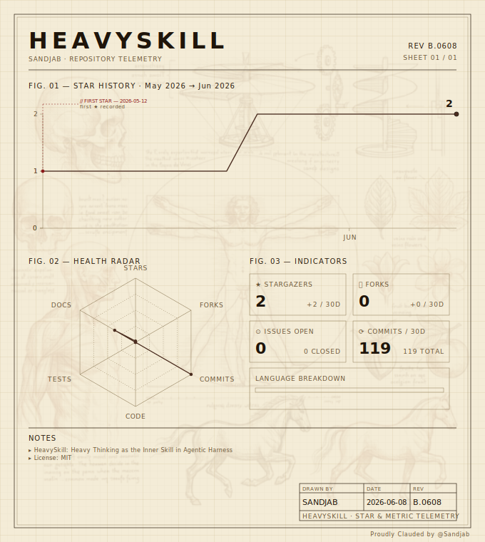

# HeavySkill

Implementation of **"HeavySkill: Heavy Thinking as the Inner Skill in Agentic Harness"** ([arXiv:2605.02396v1](https://arxiv.org/abs/2605.02396)).

HeavySkill is a training-free reasoning amplification technique. Faced with a complex problem, an agent equipped with this skill:

1. Spawns **K independent reasoning agents** in parallel — each one solves the problem from scratch with no access to the others' work.
2. Performs **sequential deliberation** over the K trajectories — explicitly *not* a majority vote, but a critical meta-analysis that can override consensus, promote a well-reasoned minority answer, or reject all trajectories and re-derive the result.

The paper reports that the same `SKILL.md` document works unchanged under Claude Code and custom orchestration harnesses, and that the resulting `HM@K` consistently beats majority voting (`V@K`) and approaches the theoretical `P@K` upper bound on AIME25, HMMT25-Feb, and GPQA-Diamond.

## Repository layout

```
HeavySkill/
├── .claude-plugin/
│   └── plugin.json            # Claude Code plugin manifest
├── skills/
│   └── heavy-thinking/
│       └── SKILL.md           # The canonical skill document (verbatim from the paper)
├── examples/
│   └── usage.md               # Concrete activation examples
├── LICENSE
└── README.md
```

The `SKILL.md` file is the entire implementation. Everything else is packaging.

## Installation

### As a Claude Code plugin (recommended)

From inside Claude Code:

```
/plugin install https://github.com/<owner>/HeavySkill
```

Or clone the repo and install locally:

```bash
git clone https://github.com/<owner>/HeavySkill ~/.claude/plugins/heavyskill
```

Restart Claude Code. The `heavy-thinking` skill becomes available globally and auto-activates on problems matching the description in the skill frontmatter.

### As a standalone skill

Copy `skills/heavy-thinking/SKILL.md` into your global skills directory:

```bash
mkdir -p ~/.claude/skills/heavy-thinking
cp skills/heavy-thinking/SKILL.md ~/.claude/skills/heavy-thinking/
```

### In a custom (non-Claude-Code) harness

The skill is harness-agnostic. The deliberation prompt template and the parallel-trajectories prompting function are both inside `SKILL.md`. A custom harness only needs:

1. A way to call the policy `K` times in parallel on the same query.
2. The `build_deliberation_prompt` helper shown in `SKILL.md`.
3. A final call to the policy on the deliberation prompt.

Recommended sampling parameters from the paper: `temperature=1.0`, `top_p=0.95`, `top_k=10`.

## Usage

Once installed, the skill auto-activates on problems matching its trigger description. You can also invoke it explicitly:

> Activate heavy-thinking and solve: Find the number of ordered pairs $(a,b)$ of integers such that $|a + bi| \le 5$ and $a^2 + b^2$ is prime.

Behind the scenes:

1. The main agent spawns **K=3** parallel reasoning subagents via the `Agent` tool in a single message.
2. Each subagent independently produces a complete reasoning chain.
3. The main agent collects all three trajectories, runs the deliberation analysis itself (it does **not** delegate this step), and produces the final boxed answer.

## Astonishing examples

Three scenarios that illustrate why **deliberation outperforms voting** — and why heavy thinking is more than triple-cost overhead. Each example is shown as it would unfold in a Claude Code session: three parallel trajectories, then the deliberation step that produces the final answer.

### Example 1 — The minority is right (consensus is wrong)

> **Problem.** Determine all real numbers $\alpha$ such that, for every positive integer $n$, the sum $\lfloor \alpha \rfloor + \lfloor 2\alpha \rfloor + \cdots + \lfloor n\alpha \rfloor$ is divisible by $n$.

**Stage 1 — three parallel trajectories.**

| | Approach | Conclusion |
|---|---|---|
| **Thinker #1** | "If $\alpha$ is an integer, the floors disappear and the sum becomes $\alpha \cdot n(n+1)/2$, which is always divisible by $n$." | $\alpha \in \mathbb{Z}$ |
| **Thinker #2** | Same intuition as #1, plus checks $\alpha = 1, 2, 3$ numerically for $n = 1, 2, 3$ and sees no contradiction. | $\alpha \in \mathbb{Z}$ |
| **Thinker #3** | Tests $\alpha = 1$ at $n = 2$: sum is $1 + 2 = 3$, *not* divisible by 2. Tests $\alpha = 2$: sum is $2 + 4 + 6 + \cdots = n(n+1)$, divisible by $n$. Tests $\alpha = 3$ at $n = 2$: sum is $3 + 6 = 9$, not divisible by 2. Conjectures the parity-controlled answer: $\alpha$ is an **even** integer. | $\alpha \in 2\mathbb{Z}$ |

**Stage 2 — deliberation.** Two thinkers agree on "any integer" but only one tested specific cases. The main agent verifies Thinker #3's counterexample $\alpha = 1, n = 2$: the sum is indeed 3, and $2 \nmid 3$. The "any integer" consensus collapses on contact with a concrete test. The deliberator promotes the minority answer.

> **Final answer.** $\alpha$ is an even integer (i.e. $\alpha \in 2\mathbb{Z}$).

A majority-vote scheme would have returned the wrong answer. Deliberation catches the trap because it *re-checks* claims rather than aggregating them.

---

### Example 2 — Three radically different paths converge

> **Problem.** Compute $\displaystyle \sum_{k=1}^{\infty} \frac{1}{k^2 \, 2^k}$ in closed form.

**Stage 1 — three parallel trajectories.**

| | Approach | Steps |
|---|---|---|
| **Thinker #1** | Power series. Starts from $-\ln(1-x) = \sum_{k \ge 1} x^k / k$, divides by $x$, integrates from 0 to $1/2$. | $\int_0^{1/2} \frac{-\ln(1-x)}{x}\,dx$ |
| **Thinker #2** | Integral representation. Writes $1/k^2 = \int_0^1 \int_0^1 (xy)^{k-1}\,dx\,dy$, swaps sum and integrals, evaluates. | A double integral over $[0,1]^2$ |
| **Thinker #3** | Special-function identity. Recognises the sum as $\mathrm{Li}_2(1/2)$ and invokes the known identity. | Direct closed form |

**Stage 2 — deliberation.** Three completely different machines (real analysis, double integrals, polylogarithm identities) yield the *same* closed form. The deliberator notes that triple cross-validation across independent frameworks is far stronger evidence than three majority-voting trials, and accepts the answer with high confidence.

> **Final answer.** $\displaystyle \sum_{k=1}^{\infty} \frac{1}{k^2 \, 2^k} = \mathrm{Li}_2\!\left(\tfrac{1}{2}\right) = \frac{\pi^2}{12} - \frac{(\ln 2)^2}{2}.$

This is the textbook case where HeavySkill's `HM@K` approaches the `P@K` upper bound: any one of the three paths suffices, and their agreement makes the answer essentially certain.

---

### Example 3 — All three are wrong, deliberation re-derives

> **Problem.** I tell you "I have two children. At least one is a boy born on a Tuesday." Assuming each child is independently a boy or girl with probability $1/2$ and each day of the week with probability $1/7$, what is the probability that both children are boys?

**Stage 1 — three parallel trajectories.**

| | Reasoning | Answer |
|---|---|---|
| **Thinker #1** | "The day of the week is irrelevant. Given at least one boy, $P(\text{both boys}) = 1/3$." | $1/3$ |
| **Thinker #2** | "The two children are independent and the day is given for one of them, so $P(\text{the other is a boy}) = 1/2$." | $1/2$ |
| **Thinker #3** | Sets up Bayes but miscounts the favorable outcomes (14 instead of 13). | $14/27$ |

**Stage 2 — deliberation.** The deliberator notes that the three answers contradict each other — there is no majority and no obvious quality ranking from the trajectories alone. It refuses to vote and re-derives the answer from scratch.

Enumerate ordered pairs (child 1, child 2) with each child labeled by sex and day, $14 \times 14 = 196$ equally likely outcomes. Outcomes containing at least one "boy-Tuesday": by inclusion–exclusion, $14 + 14 - 1 = 27$. Outcomes with at least one boy-Tuesday *and* both boys: pairs where each child is a boy on any day, intersected with "at least one is Tuesday": $7 + 7 - 1 = 13$. Therefore $P(\text{both boys} \mid \text{at least one boy-Tuesday}) = 13/27$.

The deliberator confirms that Thinker #3 had the right framework but the wrong count; the right answer is *almost* its answer, off by exactly one outcome (the double-count).

> **Final answer.** $\boxed{\dfrac{13}{27}}$.

This is the strongest case for heavy thinking: every individual trajectory was wrong, yet the deliberation step produced the correct answer. A single chain-of-thought (no matter how careful) cannot do this; a majority vote across the three trajectories cannot do this. The synthesis step **is** the value.

---

### What these examples have in common

| | Pattern | Why naive aggregation fails | What deliberation does |
|---|---|---|---|
| **Ex. 1** | Minority correct | 2-vs-1 vote elects the wrong answer | Re-verifies the consensus claim, finds the counterexample, flips |
| **Ex. 2** | Convergence | Voting is fine but provides no extra signal | Recognizes that *independent* derivations are stronger than repeated trials |
| **Ex. 3** | All wrong | No majority; voting is undefined | Refuses the vote, re-derives, validates against the closest near-miss |

These are exactly the three failure modes of Best-of-N / majority voting that the HeavySkill paper sets out to fix. The skill is cheap (`K=3` parallel agents run concurrently → ≈ single-trajectory latency, 3× tokens) and the gain is largest precisely on the problems where a single chain-of-thought would have failed.

## When to use HeavySkill

The skill auto-triggers on:

- Competition math (AIME, HMMT, IMO, Putnam style)
- GPQA-style hard science / STEM questions
- Intricate logical deduction and proof problems
- Algorithmic / code-competition problems
- Any task where you feel uncertain about your initial approach

It deliberately does **not** trigger on:

- Simple factual lookups
- Casual conversation
- Straightforward code edits with an obvious solution
- Pure information-retrieval tasks

## Parameters

The paper's recommended settings, summarized:

| Parameter | Harness default | Workflow default | Notes |
|-----------|-----------------|------------------|-------|
| `K` (parallel trajectories) | 3 | 8 or 16 | Larger `K` raises `P@K` ceiling but costs more |
| `K⁽¹⁾` (deliberation outputs) | 1 | 4 | For HM@K / HP@K reporting |
| `N` (iterations) | 1 | 1 | Iterate 2–3× only if first pass is inconclusive |
| `temperature` | 1.0 | 1.0 | High diversity across trajectories |
| `top_p` | 0.95 | 0.95 | |
| `top_k` | 10 | 10 | |

## Metrics

When running offline evaluations of HeavySkill quality, report:

- **M@K** — Mean accuracy across `K` independent trajectories
- **P@K** — Proportion of problems with ≥1 correct trajectory (upper bound)
- **V@K** — Majority-vote accuracy across `K` trajectories
- **HM@K** — Heavy-Mean accuracy: mean over `K⁽¹⁾` deliberation outputs
- **HP@K** — Heavy-Pass: proportion where ≥1 of `K⁽¹⁾` deliberation outputs is correct

The headline claim of the paper is that `HM@K > V@K` (deliberation beats voting) and `HM@K ≈ P@K` on frontier models (deliberation captures most of the reachable correct answers).

## License

MIT — see [LICENSE](./LICENSE).

## Citation

```bibtex
@article{heavyskill2026,
  title  = {HeavySkill: Heavy Thinking as the Inner Skill in Agentic Harness},
  year   = {2026},
  eprint = {2605.02396},
  archivePrefix = {arXiv}
}
```

## Dashboard

<picture>
  <source media="(prefers-color-scheme: dark)" srcset="assets/dashboard-dark.svg">
  
</picture>

*Rendered every 6 hours by [Cartouche](https://github.com/Sandjab/cartouche) — vellum-davinci theme.*
